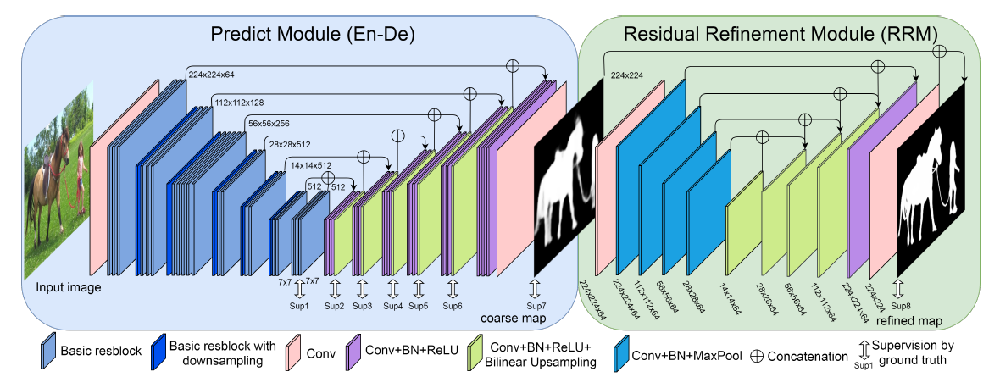
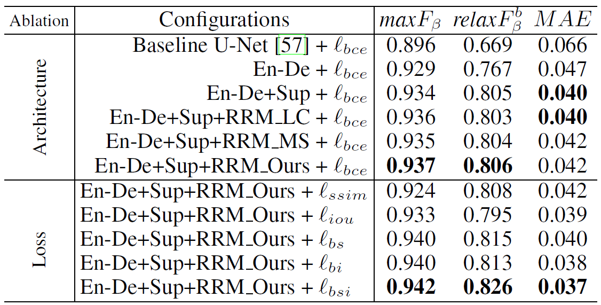
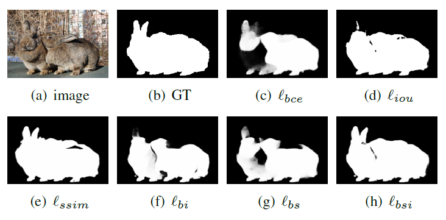
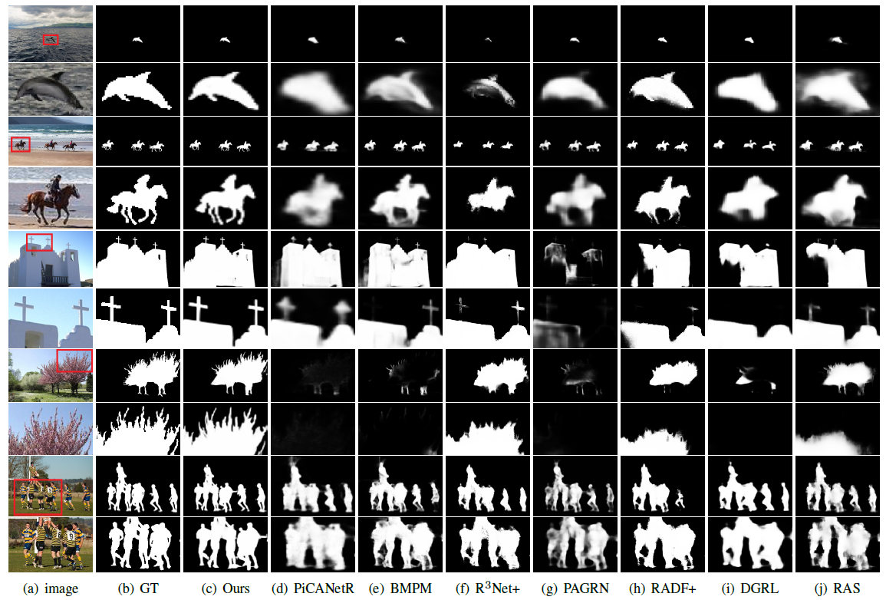

作者 | 文永亮

学校 | 哈尔滨工业大学（深圳）

研究方向 | 目标检测、GAN

## 概要

​	这是一篇发表于**CVPR2019**的关于显著性目标检测的paper，**《BASNet：Boundary-Aware Salient Object Detection》[1]**显而易见的就是关注边界的显著性检测，**主要创新点在loss的设计上，使用了交叉熵、结构相似性损失、IoU损失这三种的混合损失，使网络更关注于边界质量，**而不是像以前那样只关注区域精度。在单个GPU上能跑25 fps，在六种公开数据集上能达到 **state-of-the-art**的效果。作者也在**github**上放出了源码：<https://github.com/NathanUA/BASNet>

## 模型架构

Fig 1. BASNet 的网络结构

这个网络结构的特点：

- **采用深层编码器-解码器的结构得到一个粗糙的结果**
- **采用RRM（Residual Refinement Module）修正结果，使用了残差模块**

$$
S_{refined}=S_{coarse}+S_{residual}
$$

 Fig 2. (a)红色：GT（Ground Truth，以下都简称GT）的概率图，(b)绿色：粗糙边界与GT不对齐，(c)蓝色：粗糙区域内部判定概率也低，(d)紫色：粗糙的预测通常都有这两个问题。

其中“粗糙“定义为两个方面：

- **如Fig 2(b)所示，粗糙表现在边界无法与GT对齐。**
- **如Fig 2(c)所示，粗糙表现在不均匀的区域预测概率。**

而经过前面步骤的得到的真正的粗糙结果通常都是带有以上两个问题。

##  loss上的设计

三种loss的叠加对应三个层次：（这让我想起了之前的Libra R-CNN也是三个平衡对应三个层次）
$$
\ell^{(k)}=\ell_{b c e}^{(k)}+\ell_{s s i m}^{(k)}+\ell_{i o u}^{(k)}
$$
**$\ell_{b c e}^{(k)}$ 对应pixel-level，$\ell_{s s i m}^{(k)}$ 对应patch-level，$\ell_{i o u}^{(k)}$ 对应map-level。**
$$
\ell_{b c e}=-\sum_{(r, c)}[G(r, c) \log (S(r, c))+(1-G(r, c)) \log (1-S(r, c))]
$$
$\ell_{bce}$ 就是最基本的最常用的二值交叉熵，其中$G(r,c)\in\{0,1\}$ 表示（r, c）像素点是否为GT label，$S(r,c)$ 表示预测出(r, c)像素点为显著物体的概率。
从结构相似性指标引出结构相似性损失：
>$$
>\operatorname{SSIM}(x, y)=\frac{\left(2 \mu_{x} \mu_{y}+c_{1}\right)\left(2 \sigma_{x y}+c_{2}\right)}{\left(\mu_{x}^{2}+\mu_{y}^{2}+c_{1}\right)\left(\sigma_{x}^{2}+\sigma_{y}^{2}+c_{2}\right)}
>$$
>作为结构相似性理论的实现，结构相似度指数从图像组成的角度将结构信息定义为独立于亮度、对比度的，反映场景中物体结构的属性，并将失真建模为亮度、对比度和结构三个不同因素的组合。**用[均值](https://baike.baidu.com/item/均值)作为亮度的估计，标准差作为对比度的估计，[协方差](https://baike.baidu.com/item/协方差)作为结构相似程度的度量。[2]**
$$
\ell_{\text {ssim}}=1-\frac{\left(2 \mu_{x} \mu_{y}+C_{1}\right)\left(2 \sigma_{x y}+C_{2}\right)}{\left(\mu_{x}^{2}+\mu_{y}^{2}+C_{1}\right)\left(\sigma_{x}^{2}+\sigma_{y}^{2}+C_{2}\right)}
$$
$\ell_{ssim}$ 是结构相似性损失，SSIM就是structural similarity index的意思，**这是本文关注边界的重点部分，是为了评估图片质量的，捕捉结构化信息，是用于学习显著性目标与GT之间的结构化信息的。**结构相似性损失的表达如上面的公式（3）所示。

**简单的来说，就是要计算两张图的结构相似性，我们需要开一个局部窗口（N x N大小的），计算窗口内的结构相似性损失，以像素为单位滑动，最后取所有窗口的结构相似性损失的平均。** 具体计算方式就是令两张图片的对应像素点表示为为$x$和$y$，其中$x=\{x_j:j=1, ...,N^2\}$ 和$y=\{y_j:j=1,...,N^2\}$ ，因为窗口大小为$N\times N$ ，$\mu_x,\mu_y$ 和$\sigma_x,\sigma_y $ 分别是$x$和$y$的均值和方差，$\sigma_{xy}$为$x$和$y$的协方差。$C_1=0.01^2$和$C_2=0.03^2$是为了避免分母为0。

SSIM损失作用于patch-level的，关键在于它着眼于边界，但是这个标准真的能着眼于边界吗？**具体地讲，就是会对边界对不上的地方加大惩罚吗？**作者用**热力图(heatmap)**可视化了整个训练过程损失的变化，用来阐述各种loss的作用。

Fig 3. P_fg和P_bg是表示预测为前景或背景的概率。

可以看到Fig 3的这三行热力图变化，颜色越红代表损失对待该像素点的权重越大，也就是越重视该点，越蓝表示权重对待越小。从第一行的BCE损失变化可以看出，**BCE损失是pixel-wise的，它是一个非常公平的损失函数，对待前景和背景一开始区别不大，训练过程中几乎达到了任何像素点都一视同仁**。

而第二行关于结构相似性损失的变化，**可以看到无论$\hat{P}_{fg}$和$\hat{P}_{bg}$怎么变化都是对显著物体边界赋予较高的权重**。

第三个损失是**IoU损失**，就是**交叠率损失**，数学表达式如下：
$$
\ell_{i o u}=1-\frac{\sum_{r=1}^0{H} \sum_{c=1}^{W} S(r, c) G(r, c)}{\sum_{r=1}^{H} \sum_{c=1}^{W}[S(r, c)+G(r, c)-S(r, c) G(r, c)]}
$$
其中的$S(r,c),G(r,c)$都与$\ell_{ssim}$表示的一致。文中也没有对其做过多的解释。

## 实验结果

对于RRM模块，作者在对比实验中用了下面三种，(c)是文章所用的结构：

Fig 4. (a) local boundary refinement module RRM_LC; (b) multi-scale refinement module RRM_MS; (c) our encoder-decoder refinement module RRM_Ours

对于不同的结构和不同的损失函数做了组合对比实验，得到下面的表格：

Table 1. 各种loss和基础网络结构的组合的对比

其中的$F_{\beta}$如下：
$$
F_{\beta}=\frac{\left(1+\beta^{2}\right) \times \text {Precision} \times \text {Recall}}{\beta^{2} \times \text {Precision}+\text {Recall}}
$$

$relaxF_\beta$是边界评价标准，可以参考文献**[3]**。

下面是各种loss的情况下，显著性检测的效果，在传统困难的多物体重合与背景差别不大的情况下，从效果图中能看到三种loss一起的效果跟有结构性损失的效果都表现的不错。

各种方法的对比下，在$relaxF_\beta$的标准下始终能够达到**state-of-the-art**的效果，但是对于$maxF_\beta$这个评价标准，并不能在所有的数据集上做到最好，这也是因为这个方法着眼于解决边界质量。

## 总结

​	BASNet该方法主要的亮点在于引入**结构相似性损失**，最后三种损失**（BCE损失，SSIM损失，IoU损失）**相加，同时考虑，着眼于解决边界模糊问题，更注重边界质量，**因为在结构相似性损失下，边界的损失会比显著性物体内部或其他地方赋予的权重更高。**文章也尝试从三种层次上解答为什么设计三个损失，结构还算清晰。但是个人认为主要还是结构相似性损失的引入比较有价值。

## 参考文献

[1]. Xuebin Qin, Zichen Zhang, Chenyang Huang, Chao Gao, Masood Dehghan, Martin Jagersand. BASNet: Boundary-Aware Salient Object Detection. The IEEE Conference on Computer Vision and Pattern Recognition (CVPR), 2019, pp. 7479-7489

[2]. Zhou Wang, Eero P Simoncelli, and Alan C Bovik. Multiscale structural similarity for image quality assessment. In The Thrity-Seventh Asilomar Conference on Signals, Systems & Computers, 2003, volume 2, pages 1398–1402. IEEE, 2003.

[3]. Marc Ehrig and J´erˆome Euzenat. Relaxed precision and recall for ontology matching. In Proc. K-Cap 2005 workshop on Integrating ontology, pages 25–32. No commercial editor., 2005.